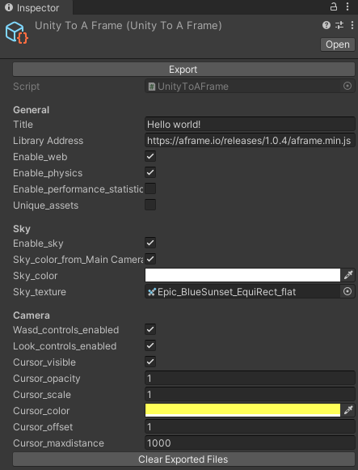

unity-to-aframe
===============

Convert a Unity 3D scene [A-Frame](https://aframe.io/).


## About

Unity-to-aframe is an easy Unity 3D plug-in to automatically export your scene to a WebVR virtual reality web page, using A-Frame.

Exported scenes include 3D objects, animations, textures, lighting, and audio.

*Compatible with A-Frame version [1.1.0](https://aframe.io/docs/1.1.0/introduction/)+.*

## Quick Start

1. Clone [unity-to-aframe](https://github.com/primaryobjects/unity-to-aframe.git).
2. Copy `Assets/unity-to-aframe` and `Assets/CombineMeshes` to the folder `Assets` in your Unity 3D project.
3. Open your project from Unity3D.
4. Open the scene you want to export.
5. Click the unity-to-aframe prefab to show the exporter inspector.
6. Click **Export** in the inspector.
7. Find the `index.html` file in your project Assets folder under `Assets/unity-to-aframe/export/index.html`
8. Launch a local web server in the `/export` folder using `python3 -m http.server` to view the result at `http://localhost:8000`

### Additional Notes

- You may need to copy `.png` images into the folder `Assets/unity-to-aframe/export/images` for textures used by your scene.

- Some models render better using gltf format, instead of obj. You can convert your models using [gltf-exporer](https://github.com/Plattar/gltf-exporter) from within Unity and save to your `/export/models` directory. Finally, edit your exported index.html to load the gltf by changing the `<a-obj-model>` tag to `<a-gltf-model src="models/your_model.gltf"></a-gltf-model>`

- Linux users may need to install the following libraries: `sudo apt install libc6-dev` and `sudo apt install libgdiplus`.

## Using Sound Effects

To add spatial sound effects to your VR scene, use the following [steps](https://gist.github.com/primaryobjects/66516de4423f302856ecb82f23edb07e#a-frame-audio-sound-in-ios) below.

1. [Download](https://www.freesoundeffects.com/free-sounds/airplane-10004/) sound effects (mp3, wav) and copy to `Assets/unity-to-aframe/export/sounds`.
2. In your `index.html` file, add the following section:
    ```html
    <assets>
        <audio id="mysound" src="mysound.mp3" preload="auto"></audio>
    </assets>
    ```
3. To add sound to a specific object, use the following example:
    ```html
    <a-box src="url(images/box.png); audio="src: #mysound; loop: true; distance: 8;"></a-box>
    ```

Sound effects use [Howler.js](https://howlerjs.com/) and are compatible with Chrome, Safari, mobile devices, Android, and Apple iPhone iOS.

### Audio Tag Options

```
loop: boolean, true to play sound effect continuously, default is false
volume: integer, default is 1
distance: integer, how close the camera must be to the object before playing audio, default is 8
fade: integer, how quickly the sound fades when moving away from the object, default is 5000
```

## Export Options



### General

Title
  Title of A-Frame.

Library Address
  A-Frame library address you want to use.

Enable_performance_statistics
  Show Performance Statistics.

### Sky

Enable_Sky
  Enable A-Frame Sky.

Sky_color_from_Main Camera_Background
  Use sky color from Main Camera Background.

Sky_color
  Sky color.

Sky_texture
  Sky texture.

### Camera

Wasd_controls_enabled
  Enable WASD control.

Look_controls_enabled
  Enable Look control.

Enable_Sky
  Enable A-Frame Sky.

Cursor_visible
  Change cursor visible.

Cursor_opacity
  Change cursor opacity.0 to 1.

Cursor_scale
  Change cursor scale.

Cursor_color
  Change cursor color.

Cursor_offset
  Change cursor offset.
  
Cursor_maxdistance
  Change cursor max distance.

### Clear Exported Files

Clean exported files. Note, if you edited files in this folder, they will be deleted.

## Supported Unity3D Objects

### Main Camera

Supported parameters are Position, Rotation, Fov, NearClip, FarClip.

### Light

Directional, Point, Spot
Supported parameters are Position, Rotaion, Intensity, Color.

### Single Sprite

Export as Image.

### Cube

Export as Box.
Supported parameters are Scale xyz.

### Sphere

Export as Sphere.
Scale parameters are exported average xyz. because A-Frame Sphere have parameter only radius.

### Cylinder

Export as cylinder.
Scale y export as height.
Scale xz are exported average for A-Frame cylinder radius.

### Plane

Export as plane.

### Other Meshes

Export as Obj.

### Physics Engine

Using the [aframe-particle-system-component](https://github.com/IdeaSpaceVR/aframe-particle-system-component).

### Sound Engine

Using [Howler.js](https://howlerjs.com/) with spacial audio to play sound effects as you approach objects. See [example](https://gist.github.com/primaryobjects/66516de4423f302856ecb82f23edb07e#file-index-html) for how to add to your VR objects.

## References

This project was originally forked from [UnityAFrameExporter](https://github.com/umiyuki/UnityAFrameExporter).